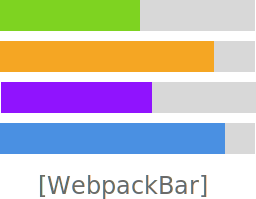
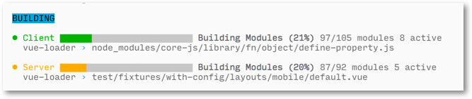

[![npm][npm]][npm-url]
[![deps][deps]][deps-url]
[![test][test]][test-url]
[![test-windows][test-win]][test-win-url]
[![coverage][cover]][cover-url]

<div align="center">
  <!-- replace with accurate logo e.g from https://worldvectorlogo.com/ -->
  
  <a href="https://webpack.js.org/">
    
  </a>
  <p>Elegant ProgressBar and Profiler for Webpack</p>
</div>

✔ Display elegant progress bar while building or watch

✔ Support of multiple concurrent builds (useful for SSR)

✔ Pretty print filename and loaders

✔ Windows compatible

✔ Customizable

✔ Advanced build profiler

<div align="center">
<br>

<p>Multi progress bars</p>
<br>
</div>

<div align="center">
<br>

<p>Build Profiler</p>
<br>
</div>

<h2 align="center">Getting Started</h2>

To begin, you'll need to install `webpackbar`:

Using npm:

```bash
npm install webpackbar -D
```

Using yarn:

```bash
yarn add webpackbar -D
```

Then add the reporter as a plugin to your webpack config.

**webpack.config.js**

```js
const webpack = require('webpack');
const WebpackBar = require('webpackbar');

module.exports = {
  context: path.resolve(__dirname),
  devtool: 'source-map',
  entry: './entry.js',
  output: {
    filename: './output.js',
    path: path.resolve(__dirname)
  },
  plugins: [
    new WebpackBar()
  ]
};
```

<h2 align="center">Options</h2>

### `name`
  - Default: `webpack`

Display name

### `color`
  - Default: `green`

Display color (can be HEX like `#xxyyzz` or a web color like `green`).

### `profile`
  - Default: `false`

Enable profiler.

### `stream`
  - Default: `process.stderr`

Output stream.


### `minimal`
  - Default: Auto enabled on CI, non-TTY and test environments

Hide progress bar and only show Compiling/Compiled messages.

### `compiledIn`
  - Default: `true`

Show `Compiled in ` message after build.

### `done`
  - Type: `Function(sharedState, ctx)`

A function that will be called when **all** builds are finished.

<h2 align="center">Maintainers</h2>

<table>
  <tbody>
    <tr>
      <td align="center">
        <a href="https://github.com/pi0">
          
          </br>
          Pooya Parsa
        </a>
      </td>
    </tr>
  <tbody>
</table>

[npm]: https://img.shields.io/npm/v/webpackbar.svg?style=flat-square
[npm-url]: https://npmjs.com/package/webpackbar

[deps]: https://david-dm.org/nuxt/webpackbar.svg?style=flat-square
[deps-url]: https://david-dm.org/nuxt/webpackbar

[test]: https://img.shields.io/circleci/project/github/nuxt/webpackbar/master.svg?style=flat-square
[test-url]: https://circleci.com/gh/nuxt/webpackbar

[test-win]: https://img.shields.io/appveyor/ci/nuxt/webpackbar.svg?logo=appveyor&style=flat-square
[test-win-url]: https://ci.appveyor.com/project/nuxt/webpackbar

[cover]: https://codecov.io/gh/nuxt/webpackbar/branch/master/graph/badge.svg?style=flat-square
[cover-url]: https://codecov.io/gh/nuxt/webpackbar
